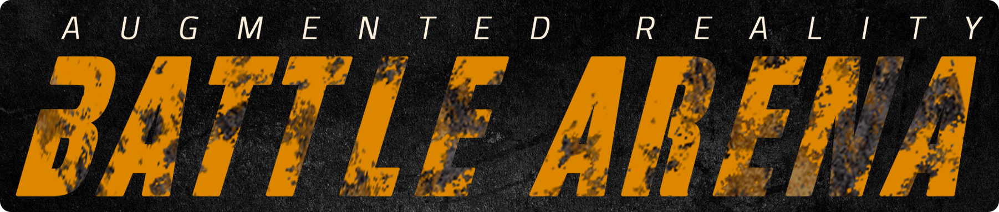

# Augmented Reality Battle Arena
The AR Battle Arena is a multiplayer augmented reality game which provides users with the experience of a street fighting games like tekken in augmented reality.

## Summary

  - [Getting Started](#getting-started)
  - [3d Modeling](#3d-modeling)
  - [UI Design](#ui-design)
  - [Implementation](#implementation)
  - [Designs & 3d Models](#designs-3d-models)
  - [Prototypes](#prototypes)

## Getting Started

### Prerequisites
- [Unity 2019.2.21f1](https://unity3d.com/get-unity/download)
- [Vuforia Engine 9.1](https://developer.vuforia.com/downloads/sdk)
- [Photon PUN 2 Free](https://assetstore.unity.com/packages/tools/network/pun-2-free-119922)

### Installation
- [Installing Unity](https://www.youtube.com/watch?v=4tygp60Lrvc)
- [Installing Vuforia Engine in Unity](https://www.youtube.com/watch?v=y7VD7yGwmV4)
- [Installing Photon Engine in Unity](https://www.youtube.com/watch?v=ph9zTdt1n2Y) 

## 3d Modeling
- Learn 3D Modeling: [Blender Guru](https://www.youtube.com/user/AndrewPPrice)
- Download/Purchase 3d resources from:
    - [Unity Asset Store](https://assetstore.unity.com/)
    - [Sketchfab](https://sketchfab.com/)
    - [Turbosquid](https://www.turbosquid.com/)
    - [CG Trader](https://www.cgtrader.com/)

## UI Design
Designing a great UI is as important as developing a good game. 

- Tools required:
    - [Adobe XD](https://www.adobe.com/products/xd.html)
    - [Adobe Photoshop](https://www.adobe.com/products/photoshop.html) / [Adobe Illustrator](https://www.adobe.com/products/illustrator.html)
- Tutorials:
    - [10 Rules of Good UI Design](https://www.youtube.com/watch?v=RFv53AxxQAo)
    - [The 2019 UI Design Crash Course for Beginners](https://www.youtube.com/watch?v=_Hp_dI0DzY4)
    
#### Design Choices

-  Typography:
    -  Primary Font: [FightThis](https://www.dafont.com/fight-this.font)
    -  Secondary Font: [Cairo](https://fonts.google.com/specimen/Cairo)
- Color Scheme:
    - Primary Color: Dark Yellow (#DD8700)
    - Secondary Color: Blackish Grey (#161616)
    - Tertiary Color: White (#FFFFFF)

## Implementation
The prototype 2 contains the most lastest implementation part in which you can Track any plane and put the Battle Arena by tapping without duplication, a very basic implementation setup which can be achieved via this [tutorial](https://library.vuforia.com/articles/Solution/ground-plane-guide.html).

## Designs & 3d Models
- Designs
    - [Logo](Designs/Logo)
    - [UI Designs](Designs/UI Design)
- 3d Models
    - [Character (Blender File)](3d Models/Character)
    - [Battle Arena (Blender File)](3d Models/Battle Arena)
    - [Renders](3d Models/Renders)

## Prototypes
- Prototype 1: Environment Tracking 
    -  [Download .apk](/Prototypes/Prototype 1 - Environment Tracking/Prototype 1 - Environment Tracking.apk)
- Prototype 2 - Arena Positiontion & UI Design
    -  [Download .apk](/Prototypes/Prototype 2 - Arena Positiontion & UI Design/Prototype 2 - Arena Positiontion & UI Design.apk)
    -  [Watch Video](/Prototypes/Prototype 2 - Arena Positiontion & UI Design/Prototype 2 Video.mp4)

